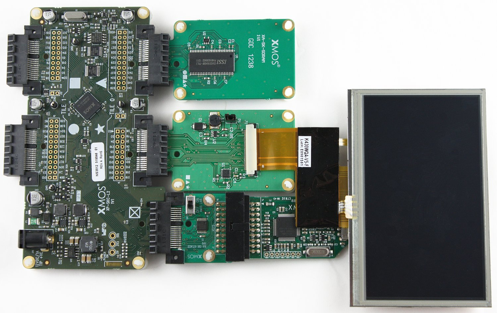

.. _Display_Controller_Demo_Quickstart:

Display Controller Demo Quickstart Guide
========================================

sw_display_controller demo : Quick Start Guide
----------------------------------------------

In this demonstration we use the following hardware and software:
  * XA-SK-SCR480 Slice Card,
  * XA-SK-SDRAM Slice Card,
  * module_sdram,
  * module_lcd,
  * module_display_controller,
  * module_slicekit_support,

together to create a double buffered LCD controller. This application showcases some of the key software features and serves as an example on how to use an LCD without the real-time contraint of having to update the LCD line buffer. 

Hardware Setup
++++++++++++++

The XP-SKC-L2 Slicekit Core board has four slots with edge conectors: ``SQUARE``, ``CIRCLE``, ``TRIANGLE`` and ``STAR``. 

To setup up the system:

   #. Connect XA-SK-SDRAM Slice Card to the XP-SKC-L2 Slicekit Core board using the connector marked with the ``TRIANGLE``.
   #. Connect XA-SK-SCR480 Slice Card to the XP-SKC-L2 Slicekit Core board using the connector marked with the ``STAR``.
   #. Connect the XTAG Adapter to Slicekit Core board, and connect XTAG-2 to the adapter. 
   #. Connect the XTAG-2 to host PC. Note that the USB cable is not provided with the Slicekit starter kit.
   #. Set the ``XMOS LINK`` on the to ``OFF`` on the XTAG Adapter(XA-SK-XTAG2).
   #. Ensure the jumper on the XA-SK-SCR480 is bridged if the back light is required.
   #. Switch on the power supply to the Slicekit Core board.

   Hardware Setup for Simple GPIO Demo
   
	
Import and Build the Application
++++++++++++++++++++++++++++++++

   #. Open xTIMEcomposer and check that it is operating in online mode. Open the edit perspective (Window->Open Perspective->XMOS Edit).
   #. Locate the ``'Display Controller Demo'`` item in the xSOFTip pane on the bottom left of the window and drag it into the Project Explorer window in the xTIMEcomposer. This will also cause the modules on which this application depends to be imported as well. 
   #. Click on the app_display_controller_demo item in the Explorer pane then click on the build icon (hammer) in xTIMEcomposer. Check the console window to verify that the application has built successfully.
   #. There will be quite a number of warnings that ``bidirectional buffered port not supported in hardware``. These can be safely ignored for this component.

For help in using xTIMEcomposer, try the xTIMEcomposer tutorial, which you can find by selecting Help->Tutorials from the xTIMEcomposer menu.

Note that the Developer Column in the xTIMEcomposer on the right hand side of your screen provides information on the xSOFTip components you are using. Select the module_display_controller component in the Project Explorer, and you will see its description together with API documentation. Having done this, click the `back` icon until you return to this quickstart guide within the Developer Column.

Run the Application
+++++++++++++++++++

Now that the application has been compiled, the next step is to run it on the Slicekit Core Board using the tools to load the application over JTAG (via the XTAG2 and Xtag Adaptor card) into the xCORE multicore microcontroller.

   #. Select the file ``app_display_controller_demo.xc`` in the ``app_display_controller_demo`` project from the Project Explorer.
   #. Click on the ``Run`` icon (the white arrow in the green circle). 
   #. At the ``Select Device`` dialog select ``XMOS XTAG-2 connect to L1[0..1]`` and click ``OK``.
   #. Wait until the images have loaded over the XTAG connector from the host, this should take approximatly 21 seconds.
   #. There should be a series of 6 images the transition from one to another.

Next Steps
++++++++++

 #. Trying changing the files that are loaded form the host. To do this, produce an image of 480 by 272 pixels, save it in ``tga`` format uncompressed in "top left" format ("bottom left" will also work but the image will have to be upside-down). Save the file(s) into ``the app_display_controller_demo`` directory within your workspace. Now, increment the ``IMAGE_COUNT`` define to 7 and add the name of your new image to the array ``images``. Ensure the filename is less than 30 characters long.
 #. Each transition has a frame count that configures the speed of the transition, try adjusting them and observe the results. To do this take a look at the API for the display controller. Note how each of the transistion effects have a ``frame_count`` parameter. This parameter specifies over how many frames the transition should take.
 #. Try writing an exciting transition effect. To do this begin with the template shown below, and refer to the Display Controller API documentation at :ref:`sec_api`:

::
      static void transition_exciting_impl(chanend server, unsigned next_image_fb,
         unsigned image_from, unsigned image_to, unsigned line) {
         //insert code here
      }
      unsigned transition_exciting(chanend server, unsigned frame_buf[2],
        unsigned from, unsigned to, unsigned frames, unsigned cur_fb_index) {
        unsigned next_fb_index;
        for (unsigned frame = 0; frame < frames; frame++) {
          next_fb_index = (cur_fb_index + 1) & 1;
          for (unsigned line = 0; line < LCD_HEIGHT; line++)
            transition_exciting_impl(server, frame_buf[next_fb_index], from, to, line);
          frame_buffer_commit(server, frame_buf[next_fb_index]);
          cur_fb_index = next_fb_index;
        }
        return cur_fb_index;
      }

    
