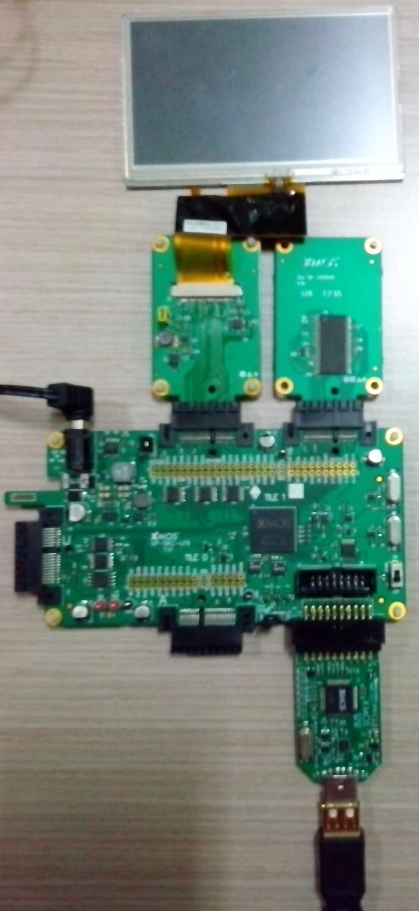

.. _Display_Spectrum_Quickstart:

Display Spectrum Quickstart Guide
=================================

In this demonstration we use the following hardware and software:

  * XP-SKC-U16 sliceKIT 
  * XA-SK-SCR480 Slice Card,
  * XA-SK-SDRAM Slice Card,
  * XA-SK-MIXED SIGNAL Slice Card,
  * module_level_meter,
  * module_fft_simple,
  * module_display_controller,
  * module_sdram,
  * module_lcd,

together to create a level-meter kind of spectral display on an LCD for a simulated signal. This application demonstrates real-time rendering and display of spectrum by taking short-time fourier transform.

Hardware Setup
++++++++++++++

The XP-SKC-U16 sliceKIT Core board has four slots with edge connectors: ``DIAMOND``, ``SQUARE``, ``A`` and ``U``. 

To setup up the system:

   #. Connect XA-SK-SDRAM Slice Card to the XP-SKC-U16 sliceKIT Core board using the connector marked with ``SQUARE``.
   #. Connect XA-SK-SCR480 Slice Card with LCD to the XP-SKC-U16 sliceKIT Core board using the connector marked with ``DIAMOND``.
   #. Connect the xTAG-2 to sliceKIT Core board. 
   #. Connect the xTAG-2 to host PC. Note that the USB cable is not provided with the sliceKIT starter kit.
   #. Set the ``xCONNECT LINK`` to ``OFF`` on the sliceKIT Core board.
   #. Ensure the jumper on the XA-SK-SCR480 is bridged if the back light is required.
   #. Switch on the power supply to the sliceKIT Core board.

   Hardware Setup for Display Spectrum Demo
   
	
Import and Build the Application
++++++++++++++++++++++++++++++++

   #. Open xTIMEcomposer and check that it is operating in online mode. Open the edit perspective (Window->Open Perspective->XMOS Edit).
   #. Locate the ``Display Spectrum Demo`` item in the xSOFTip pane on the bottom left of the window and drag it into the Project Explorer window in the xTIMEcomposer. This will also cause the modules on which this application depends to be imported as well. 
   #. Click on the ``app_display_spectrum`` item in the Explorer pane then click on the build icon (hammer) in xTIMEcomposer. Check the console window to verify that the application has built successfully.
   #. There will be quite a number of warnings that ``bidirectional buffered port not supported in hardware``. These can be safely ignored for this component.

For help in using xTIMEcomposer, try the xTIMEcomposer tutorial, which you can find by selecting Help->Tutorials from the xTIMEcomposer menu.

Note that the Developer Column in the xTIMEcomposer on the right hand side of your screen provides information on the xSOFTip components you are using. 

Run the Application
+++++++++++++++++++

Now that the application has been compiled, the next step is to run it on the sliceKIT Core Board using the tools to load the application over JTAG (via the xTAG-2) into the xCORE multicore microcontroller.

   #. Select ``app_display_spectrum`` project from the Project Explorer.
   #. Click on the ``Run`` icon (the white arrow in the green circle). 
   #. At the ``Select Device`` dialog select ``XMOS xTAG-2 connect to L1[0..1]`` and click ``OK``.
   #. The spectra of segments of mixed signal of two simulated chirp waveforms are displayed on LCD. 

Next Steps
++++++++++

   #. ``FFT_POINTS`` gives the number of signal samples taken for FFT computation. This decides the number of level meter bands which can be varied by varying ``FFT_POINTS``. ``FFT_SINE`` is also varied accordingly.
   #. The colors of the level-meter display of spectrum can be changed in ``level_meter_conf.h``.
   #. Different choices of simulated waveforms are available in ``main()`` function. Uncomment to try them. 